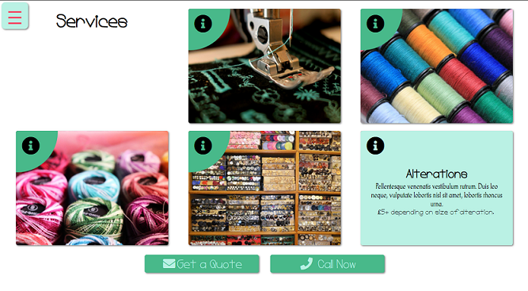

# Wolf Sews
kateeliza.co.uk/wolfSews.php

## Introduction
A fictional one-page site for a seamstress, built in July 2020.  
As with Wolf Skin, the focuses of this project were: 
* Developing design skills. 
* Practicing Sass. 
* Improving responsive development skills. 

## Technologies Used
* HTML
* CSS/Sass
* JavaScript

## Screenshots
